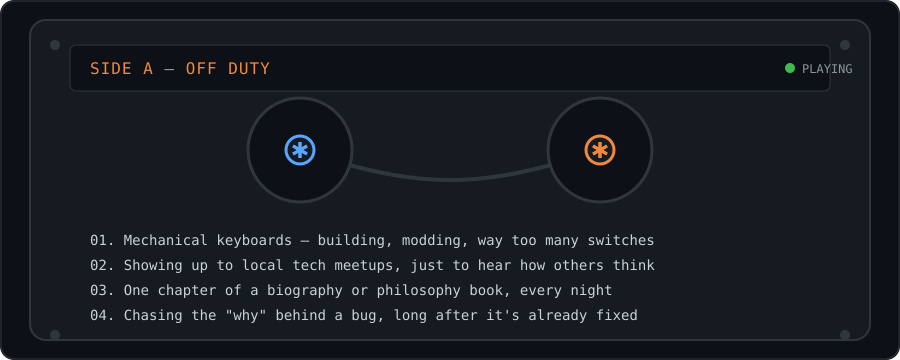

<div align="center">


<br/>


<a href="https://linkedin.com/in/salmanmhd"></a>
<a href="mailto:mhdsalman010@gmail.com"></a>

</div>

<br/>

<div align="center">

</div>

<sub>Three lines, one interchange. Frontend and Systems both feed into the Backend trunk — that's deliberate, that's roughly how the work actually happens.</sub>

<br/><br/>

### ⚡ Skill Signal

```
Next.js / React              ██████████████████░░  90%
Node.js / Express            █████████████████░░░  85%
TypeScript / JavaScript      ██████████████████░░  88%
.NET / C#                    ██████████████░░░░░░  72%
Docker / Linux               ████████████████░░░░  78%
System Design (leveling up)  ████████████░░░░░░░░  62%
```

<br/>

<div align="center">

</div>

<br/>

### 🐍 Live Contribution Snake

<picture>
  <source media="(prefers-color-scheme: dark)" srcset="https://raw.githubusercontent.com/salmanmhd/salmanmhd/output/github-contribution-grid-snake-dark.svg" />
  
</picture>

<br/><br/>

<details>
<summary>📊 the standard stats block, if you're into that</summary>
<br/>

<div align="center">


<br/>

</div>

</details>

<details>
<summary>🖥️ neofetch --about-me</summary>
<br/>

```
        salman@dev
        ──────────────────────────────
        OS:          Human, India Edition
        Uptime:      since forever, still compiling
        Shell:       zsh, occasional chaos
        Editor:      anything with vim keybindings
        Languages:   JS/TS, C#, a bit of everything
        Currently:   ./system-design.exe --verbose
        Peripherals: one too many mechanical keyboards
        Status:      compiling thoughts into code, most nights
```

</details>

<br/>

<div align="center">
<sub>if a line on the map above ever derails, that's usually where the interesting bugs live</sub>
</div>
