<div align="center">



<br/>


<a href="https://linkedin.com/in/salmanmhd"></a>
<a href="mailto:mhdsalman010@gmail.com"></a>

</div>

<br/>

```yaml
role:      Software Developer @ Jaina India Pvt Ltd
building:
  - Perbudge     # personal finance tracking platform
  - Stealth Note # privacy-first note app
leveling_up:
  - System Design
  - Advanced DSA
open_to:
  - full-stack collaborations
  - fintech products
  - open-source contributions
fun_fact: >
  mechanical keyboard tinkerer · tech-meetup regular ·
  reads biographies and philosophy when not shipping code
```

<br/>

### ⚡ Skill Signal

```
Next.js / React              ██████████████████░░  90%
Node.js / Express            █████████████████░░░  85%
TypeScript / JavaScript      ██████████████████░░  88%
.NET / C#                    ██████████████░░░░░░  72%
Docker / Linux               ████████████████░░░░  78%
System Design (leveling up)  ████████████░░░░░░░░  62%
```

<br/>

### 🗺️ Tech Radar

<table align="center">
<tr>
<td valign="top" width="25%">

**Frontend**
- Next.js
- React
- Tailwind CSS
- TypeScript

</td>
<td valign="top" width="25%">

**Backend**
- Node.js
- Express
- .NET / C#
- REST APIs

</td>
<td valign="top" width="25%">

**Data**
- MongoDB
- MySQL

</td>
<td valign="top" width="25%">

**Infra**
- Docker
- Linux
- Git
- Postman

</td>
</tr>
</table>

<br/>

### 🐍 Contribution Snake

> This repo ships with `.github/workflows/snake.yml` — once enabled it generates
> a live animation of a snake eating your commit graph, rebuilt daily.
> Merge it, then drop this line back in once the `output` branch exists:
>
> ``

<br/>

<div align="center">


</div>

<br/>

<details>
<summary>⌨️  press this — mechanical keyboard easter egg</summary>
<br/>

```
      ┌───┬───┬───┬───┬───┬───┬───┬───┬───┬───┬───┬───┬───┬───────┐
      │Esc│ F1│ F2│ F3│ F4│ F5│ F6│ F7│ F8│ F9│F10│F11│F12│  ⌦    │
      ├───┴─┬─┴─┬─┴─┬─┴─┬─┴─┬─┴─┬─┴─┬─┴─┬─┴─┬─┴─┬─┴─┬─┴─┬─┴───────┤
      │  `  │ 1 │ 2 │ 3 │ 4 │ 5 │ 6 │ 7 │ 8 │ 9 │ 0 │ - │ = │  ⌫  │
      ├─────┴┬──┴┬──┴┬──┴┬──┴┬──┴┬──┴┬──┴┬──┴┬──┴┬──┴┬──┴┬──┴─────┤
      │ Tab  │ Q │ W │ E │ R │ T │ Y │ U │ I │ O │ P │ [ │ ] │ \  │
      ├──────┴─┬─┴─┬─┴─┬─┴─┬─┴─┬─┴─┬─┴─┬─┴─┬─┴─┬─┴─┬─┴─┬─┴──────┤
      │ Caps    │ A │ S │ D │ F │ G │ H │ J │ K │ L │ ; │ ' │Enter │
      ├─────────┴┬──┴┬──┴┬──┴┬──┴┬──┴┬──┴┬──┴┬──┴┬──┴┬──┴┬────────┤
      │  Shift    │ Z │ X │ C │ V │ B │ N │ M │ , │ . │ / │ Shift  │
      └───────────┴───┴───┴───┴───┴───┴───┴───┴───┴───┴──────────┘
                     ~ thocc responsibly ~
```

</details>

<br/>

<div align="center">
<sub>compiled with ☕ and a few too many custom keycaps · reach out anytime</sub>
</div>
